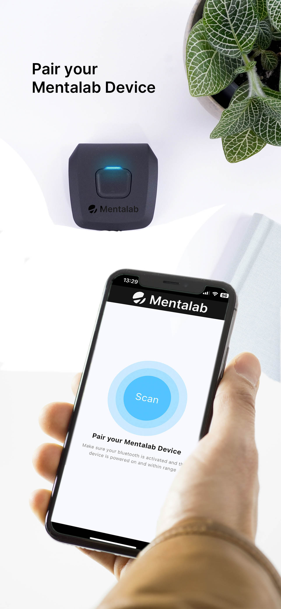
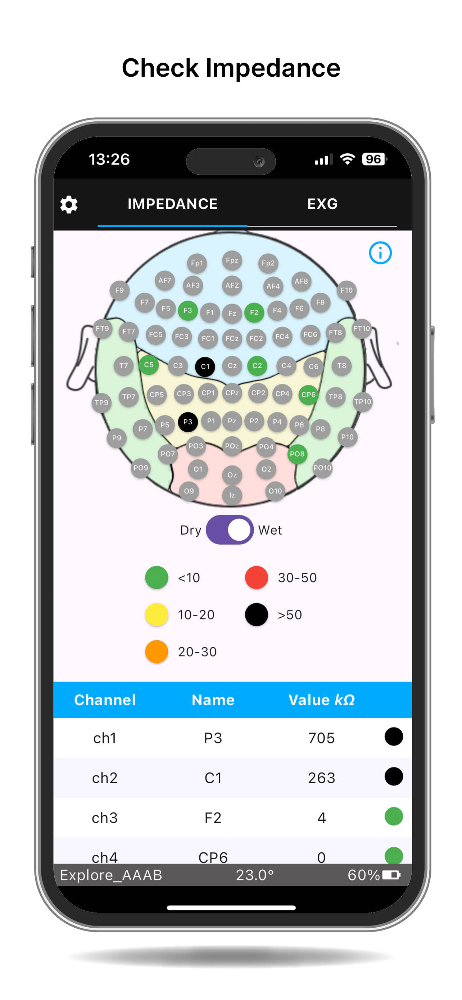
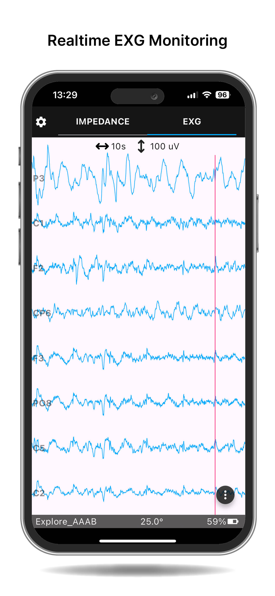

# Mentalab Explore Mobile App
The Mentalab Explore Mobile App is a cross-platform application designed to interface seamlessly with Mentalab’s ExG devices, enabling users to record and visualize biosignals in real time. 
Developed with portability and accessibility in mind, the app supports both iOS and Android platforms, allowing researchers and professionals to connect to Mentalab ExG devices via latest Bluetooth technology(BLE). 
Users can monitor, manage, and export data from EEG, ECG, EMG, and other bioelectrical signals directly from their mobile devices, making it an ideal tool for applications in neurofeedback, clinical research, and mobile health monitoring.

We also offer a flexible and cross platform mobile API for developers and reserachers. Please contact [mentalab support](mailto:contact@mentalab.com) for more documentation and technical details.

    

## Download and install
For any information or assistance, please contact support@mentalb.com and we will assist you further.

## Android:
- For Android, you can download the .apk file from here: [Android](https://github.com/Mentalab-hub/explore-mobile-app-release/releases/latest)
- For iOS, we provide an app file on request.

## Usage:

- Scan nearby Explore Devices.
- Visualize impedance data.
- Record raw ExG data.
- Change device settings.
  

    

- Visualize ExG data and apply filters in real time.

    

- Record raw ExG data in CSV format.

## Tests
Following are the devices we used to testing:

| Device            | OS version |
|-------------------|------------|
| Lenovo Tab M9     | Android 13 |
| Samsung S23 Ultra | Android 14 |
| Zenfone 10        | Android 14 |
| Pixel 7 Pro       | Android 15 |
| iPhone 13         | iOS 18     | 

## Known bugs:
- The following sampling rates are supported only in Android: 8 channels 1000Hz, 16 channels at 500 Hz, 32 channels at 250 Hz.
- When assigning channels in the impedance view and then disconnecting/reconnecting, the existing head montage remains instead of being cleared.
- The time window of the ExG visualization is not affected by changes in the sampling rate.

## Disclaimer:
The Mentalab Explore Pro app and hardware are intended strictly for research and educational applications.
